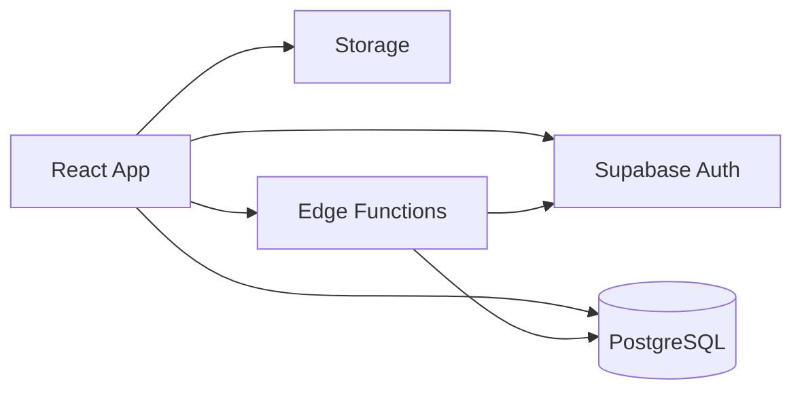

# Arquitectura

## Vision General

La aplicacion usa un enfoque full stack con frontend en React y backend sobre Supabase (Auth, PostgreSQL, Storage y Edge Functions).

## Componentes

- Frontend: React + Vite + React Router.
- Auth: Supabase Auth para login, recuperacion y sesiones.
- Base de datos: PostgreSQL en Supabase.
- Seguridad: RLS por tabla y rol.
- Archivos: Storage para imagenes de ofertas.
- Logica privilegiada: Edge Functions para operaciones internas sensibles.

## Objetivo tecnico

Reducir logica sensible en cliente y mover operaciones de alto privilegio a base de datos y funciones backend.
