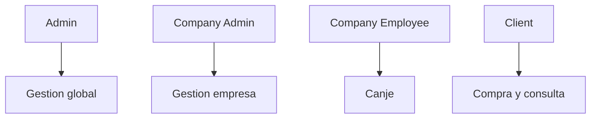

# Flujos por Rol

## Admin

- Gestion de categorias y empresas.
- Revision/aprobacion/rechazo de ofertas.
- Gestion de administradores de empresa.
- Acceso a metricas globales.

## Company Admin

- Gestion de ofertas de su empresa.
- Gestion de empleados de su empresa.
- Reenvio de ofertas rechazadas.

## Company Employee

- Canje de cupones.
- Consulta de datos necesarios para validar canje.

## Client

- Registro y autenticacion.
- Compra de cupones activos.
- Consulta de historial de cupones.

## Diagrama sugerido

